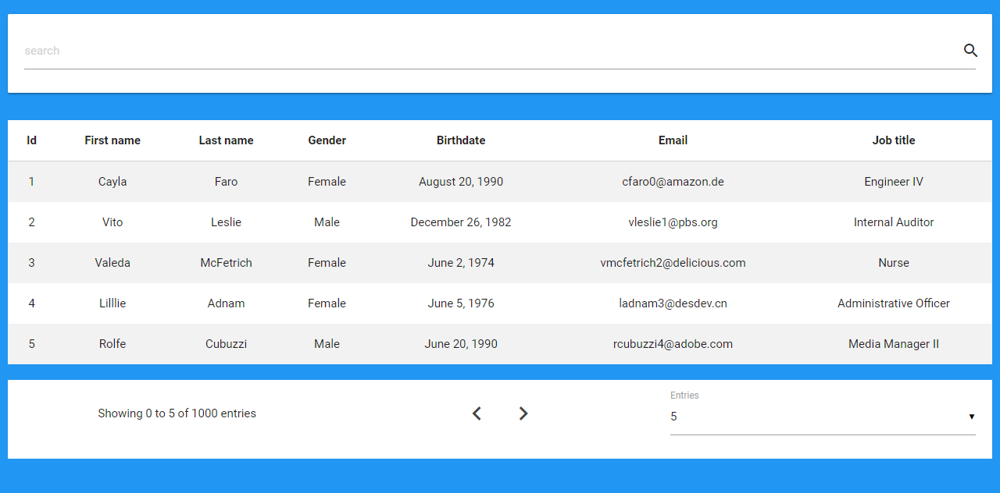

# json-datatable

[Demo](https://snwolak.github.io/data-table/dist/)

ES6 based repo for generating HTML table from JSON file.



# Features

* Sorting
* Pagination
* Filtering by one and multiple values.
* Detects Date property by reading property names. Date to properly work with momentjs has to be in ISO 8601 format.


# Requirements
* [Babel](http://babeljs.io/)
* [MomentJS](http://momentjs.com/)
* [Materializecss](http://materializecss.com/) However you can modify js files and style table with something else.
* [jQuery](https://jquery.com/)
* [SASS](https://sass-lang.com/)

# How to use
    
* Import files to your project folder.
* Import Table class from table.js file.
     
```js
import{ Table } from'./table.js';
```

* Create new instance of Table class.
        
```js
new Table(urlToJSONfile, HTMLIdForSearchBar, HTMLIdForTable, HTMLIdForFooter).create();
```
* Modify table styles in table.scss file.
# Setup for this project

    $ npm install
 
    $ npm run dev - development mode
 
    $ npm run build - production
